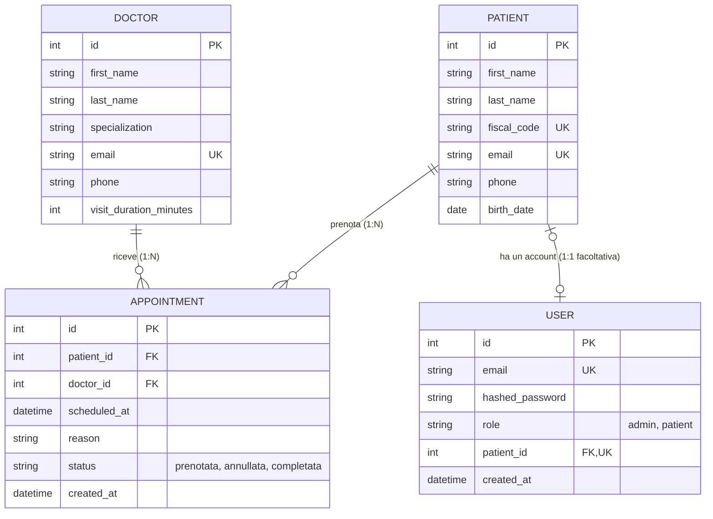

# Diagramma ER

Modello dati del sistema di prenotazione visite del Centro Medico Rossi.

Un paziente può avere più prenotazioni, un medico riceve più prenotazioni: la tabella `appointments` realizza la relazione molti-a-molti tra pazienti e medici, arricchita dagli attributi propri della prenotazione (data/ora, motivo, stato). La tabella `users` gestisce l'accesso al sistema ed è collegata all'anagrafica solo per gli utenti con ruolo paziente.

## Cardinalità

| Relazione | Cardinalità | Significato |
|---|---|---|
| Paziente – Prenotazione | 1:N | un paziente ha zero o più prenotazioni; ogni prenotazione riguarda esattamente un paziente |
| Medico – Prenotazione | 1:N | un medico ha zero o più prenotazioni; ogni prenotazione riguarda esattamente un medico |
| Paziente – Utente | 1:1 facoltativa | un paziente inserito dalla segreteria può non avere un account; l'utente amministratore non ha un'anagrafica |

Lo stato della prenotazione (`status`) è un enumerato con valori: `prenotata`, `annullata`, `completata`. Il ruolo dell'utente (`role`) è un enumerato con valori: `admin`, `patient`.

La durata della visita non è salvata sulla singola prenotazione ma dipende dal medico (`visit_duration_minutes`): serve per il calcolo degli slot disponibili e il controllo delle sovrapposizioni.
