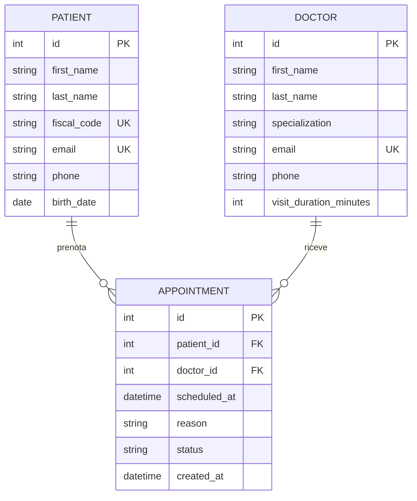

# Diagramma ER

Modello dati del sistema di prenotazione visite del Centro Medico Rossi.

Un paziente può avere più prenotazioni, un medico riceve più prenotazioni: la tabella `appointments` realizza la relazione molti-a-molti tra pazienti e medici, arricchita dagli attributi propri della prenotazione (data/ora, motivo, stato).

Lo stato della prenotazione (`status`) è un enumerato con valori: `prenotata`, `annullata`, `completata`.

La durata della visita non è salvata sulla singola prenotazione ma dipende dal medico (`visit_duration_minutes`): servirà per il calcolo degli slot disponibili e il controllo delle sovrapposizioni.
